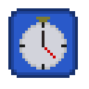

# Jumper
A very, very basic NEAT implementation of blocks trying to jump on (changing) platforms. 
This is merely a small project to test out a library and some ideas.

## How it works
There is a set amount of blocks, whose goal is to jump on every platform exactly once (in order).
These platforms are generated randomly after each generation.
What's more, after each generation the best blocks will produce offsprings that will make up the next generation (after some mutation).
This will cause the blocks to become "smarter", knowing to jump higher or further depending on the location of the next platform.
They get 2 inputs, the horizontal and vertical distance to the next platform.
They can do with these inputs what they want, but must return 2 outputs: a horizontal and vertical acceleration.
These numbers will be used to determine in what direction they jump.

The current generation can be seen in the top left corner, additional info is logged in the console (F12) to prevent cluttering of the screen.

## Buttons
There are currently 3 buttons, each one can be toggled on and off.

The clock button. 
Turning this on will reward the blocks for completing the course faster. 
This will mean the blocks will learn that jumping very high isn't exactly time efficient.
They will try to jump the absolute minimum possible. 
Enabling this can cause the blocks to take *too* much risks though, so they might fail more often.

The random terrain button.
Enabled by default, this button causes the terrain to be randomized after each generation.
If you are messing with the code and find that blocks are not exactly learning as expected, 
it might be useful to you to turn this option off and see how they behave on a fixed terrain.

The fast forward button.
Very self explanatory. Speeds up the process of evolution by drawing a frame less often, and spending more time processing all the movements.
Absolutely necessary if you want to see progress in any reasonable time frame.
It is not rare to see 1000 generations pass before any significant progress is being made.

## How to run
It is possible to [run this script in your browser](https://winnie334.github.io/jumper/). If you want to fiddle with the code however,
download or clone the repo, and open **index.html**. Alternatively you can host a local server to run it on. It should work straight away.
If not, please report the bug so I can do absolutely nothing whatsoever to fix it.
